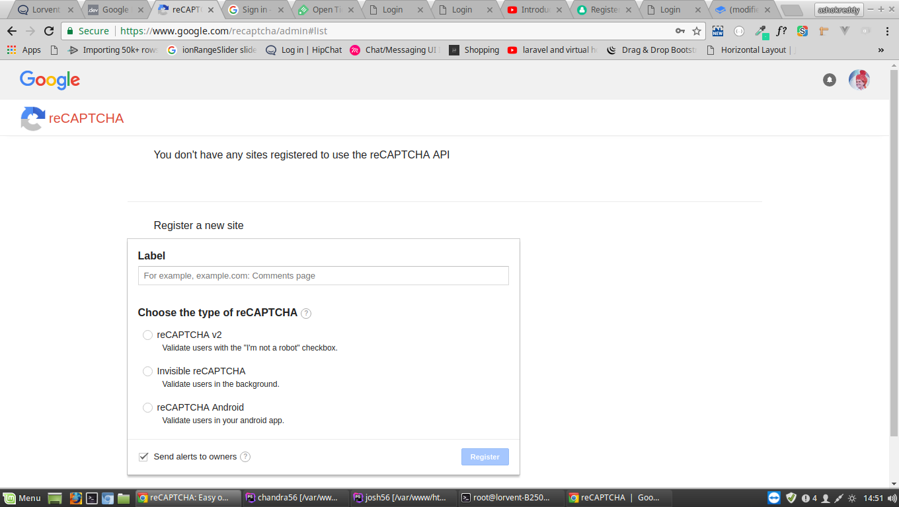
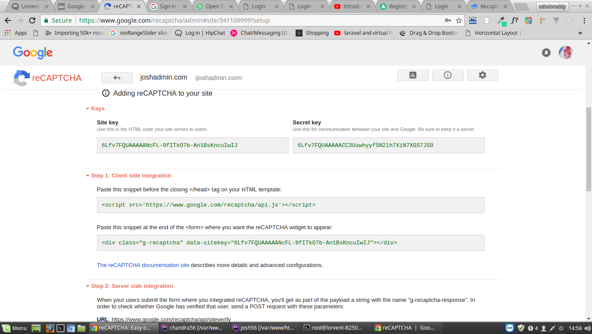

# Recaptcha

reCAPTCHA is a free service that protects your website from spam and abuse. reCAPTCHA offers more than just spam protection. Every time our CAPTCHAs are solved, that human effort helps digitize text, annotate images, and build machine learning datasets. This in turn helps preserve books, improve maps, and solve hard AI problems.

If you need Google Recaptcha you have to provide `GOOGLE_RECAPTCHA_SECRET` and `GOOGLE_RECAPTCHA_KEY in .env file`

**Steps to be followed for getting** `GOOGLE_RECAPTCHA_SECRET and GOOGLE_RECAPTCHA_KEY:`

Step1: Open this link in your browser [https://www.google.com/recaptcha/intro/android.html ](https://www.google.com/recaptcha/intro/android.html)and click the get reCAPTCHA button which is located at right top corner

Step2: You can see the screen like this

|  |
| :--- |

Here you need to write your domain name in the label field ex: For virtual host [http://chandra56.test](http://josh56.test%29%29\) then choose the type of reCAPTCHA as "**reCAPTCHA v2**".

Step3: Here you can see the DOMAIN Text field. In this field you need to give the domain name Ex: For virtual host [http://chandra56.test](http://josh56.test%29%29%29%29%20\)

Step4: Please check the Terms & Conditions.Then click on register button

Step5: Then you can see the **Site key and Secret key** on your screen as shown in below image

|  |
| :--- |

Step 6: Copy those keys into the .env file

